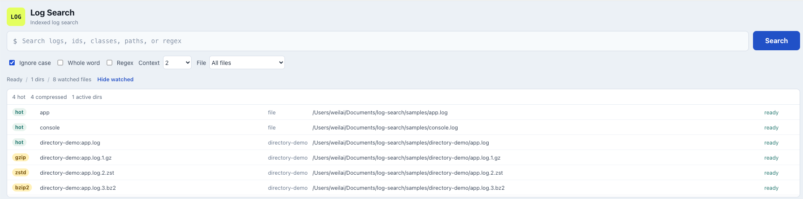
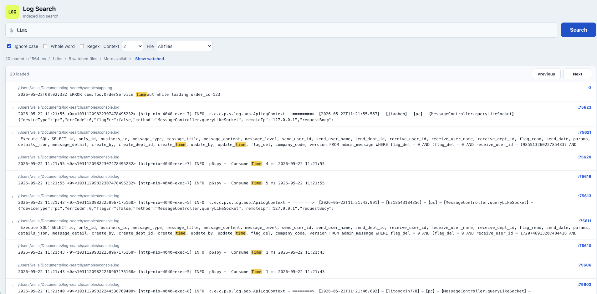
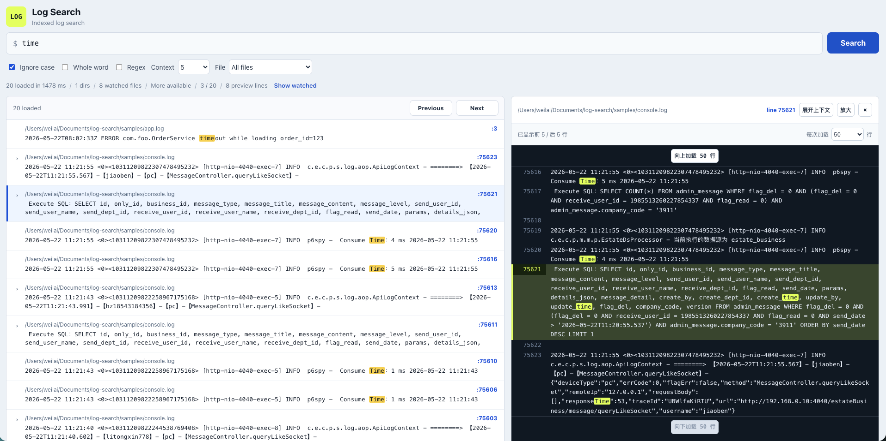
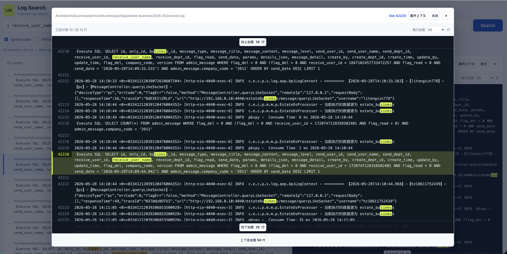

# Log Search

Log Search 是一个本地日志检索工具。把要看的日志文件写进配置，启动后在浏览器里搜索、筛选文件、查看上下文。

它适合这些场景：

- 在多份应用日志里快速找关键字。
- 搜索错误、链路 ID、订单号、用户 ID、类名、接口名。
- 用 `AND` / `OR` 组合条件缩小范围。
- 点开命中行，直接查看前后上下文。
- 日志持续写入时，索引自动更新。



## 界面预览

搜索结果：



点击结果后查看上下文：



点击放大后查看更大的上下文区域：



## 用户怎么用

发布包解压后目录大概是这样：

```text
log-search
start.sh
stop.sh
status.sh
config.toml
frontend/
data/
README.txt
log-search.service
```

使用步骤：

```bash
vim config.toml
./start.sh
```

`start.sh` 会后台启动服务，不会一直占住终端。然后打开：

```text
http://127.0.0.1:12457
```

如果要让其他机器访问，把 `config.toml` 里的地址改成：

```toml
[server]
addr = "0.0.0.0:12457"
```

## 配置日志文件

在 `config.toml` 里配置要搜索的日志：

```toml
[server]
addr = "127.0.0.1:12457"

[index]
dir = "./data/index"

[[files]]
id = "app"
path = "/var/log/my-app/app.log"

[[files]]
id = "worker"
path = "/var/log/my-app/worker.log"
```

说明：

- `id` 是页面里显示的文件名/来源名，建议写短一点。
- `path` 是真实日志路径。
- 可以配置多个 `[[files]]`。
- 页面里的 `File` 下拉框可以选择全部文件或某一个文件。

## 怎么搜索

### 搜普通关键字

```text
timeout
order_id=123
com.foo.OrderService
```

会匹配包含该文本的日志行。

### 同时包含多个词：AND

```text
timeout AND order_id
```

只匹配同时包含 `timeout` 和 `order_id` 的日志行。

### 任意一个词命中：OR

```text
timeout OR exception
```

匹配包含 `timeout` 或 `exception` 任意一个词的日志行。

### 用括号组合条件

```text
(timeout AND order_id) OR retry
```

匹配：

- 同时包含 `timeout` 和 `order_id` 的日志行
- 或者包含 `retry` 的日志行

再比如：

```text
error AND (timeout OR exception)
```

匹配包含 `error`，并且同时包含 `timeout` 或 `exception` 的日志行。

### AND / OR 规则

- 操作符必须大写：`AND`、`OR`。
- 小写 `and`、`or` 会当作普通文本搜索。
- 支持括号。
- 没写括号时，`AND` 优先级高于 `OR`。
- 暂不支持 `NOT`。

## 搜索选项

页面搜索框旁边有几个选项：

- `Ignore case`：忽略大小写。
- `Whole word`：整词匹配。
- `Regex`：按正则表达式搜索。
- `Context`：点击结果后，默认加载前后多少行。
- `File`：选择全部日志文件，或只搜索某一个日志文件。

## 查看上下文

搜索后先只显示左侧结果列表。点击某条结果后，右侧会打开上下文预览。

在上下文预览里可以：

- 查看命中行前后的日志。
- 向上加载更多行。
- 向下加载更多行。
- 放大预览区域。

## 日志变化会自动更新吗

会。

服务运行时会监听配置的日志目录，并定期兜底扫描：

- 日志文件追加内容：只索引新增行。
- 日志文件清空或截断：自动从头重建该文件索引。
- 日志文件删除后重新创建：自动识别并重建索引。
- gzip 轮转文件也会被索引，例如 `app.log.1.gz`。

## 常用命令

后台启动：

```bash
./start.sh
```

查看状态：

```bash
./status.sh
```

停止：

```bash
./stop.sh
```

查看运行日志：

```bash
tail -f logs/log-search.log
```

重建索引：

```bash
./log-search --config config.toml rebuild-index
```

清空索引：

```bash
./log-search --config config.toml clear-index
```

直接指定前端目录运行：

```bash
./log-search --config config.toml --static-dir frontend
```

## 安装为系统服务

发布包里带了 `log-search.service` 示例：

```bash
sudo cp -r . /opt/log-search
sudo cp log-search.service /etc/systemd/system/log-search.service
sudo systemctl daemon-reload
sudo systemctl enable --now log-search
```

## 开源协议

MIT
