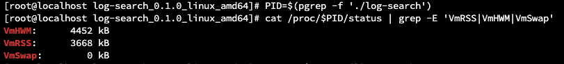
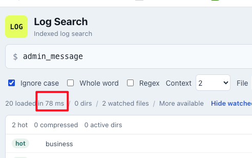
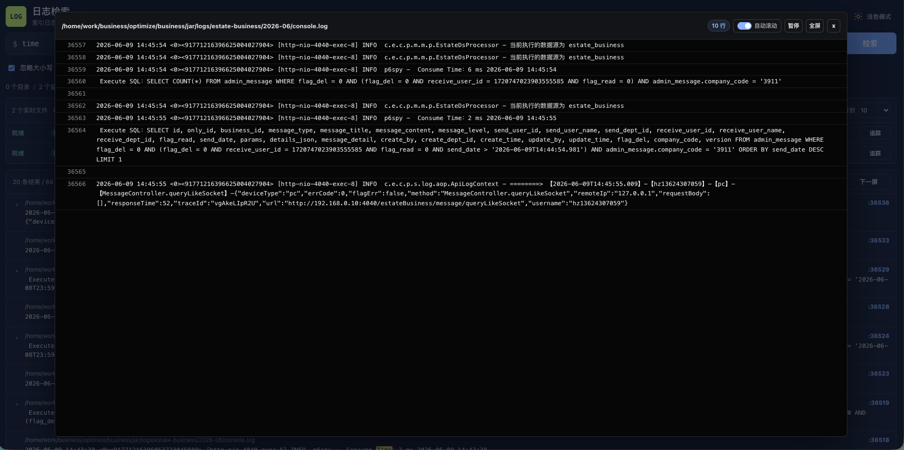

# Log Search

LogSearch是一个低内存、高性能、渐进式检索工具。

## 为什么选择 LogSearch？

- 内存占用极低
- 毫秒级检索响应
- 功能强大

实测 `3M` 内存即可检索超大日志文件并做到毫秒级响应





## 它适合这些场景：

- 开发测试环境没有条件上 elk，又不想命令检索。
- 在多份应用日志里快速找关键字。
- 搜索错误、链路 ID、订单号、用户 ID、类名、接口名。
- 用 `AND` / `OR` 组合条件缩小范围。
- 点开命中行，直接查看前后上下文。
- 日志持续写入时，索引自动更新。
- 支持多种压缩格式（gz、zst、bz2、xz等）搜索
- 支持 tail -f 实时查看日志

## 界面预览


搜索结果：


点击结果后查看上下文：


点击放大后查看更大的上下文区域：


tail -f 方式查看



## 快速开始

下载最新版本

```bash
vim config.toml
./start.sh
```

然后打开：

```text
http://127.0.0.1:12457
```

如果要让其他机器访问，把 `config.toml` 里的地址改成：

```toml
[server]
addr = "0.0.0.0:12457"
```

## 开启访问认证

如果日志服务会被其他机器访问，可以开启 HTTP Basic Auth：

```toml
[server.auth]
enabled = true
username = "admin"
password = "your-password"
realm = "Log Search"
```

开启后，访问页面和 API 都需要输入用户名密码。Basic Auth 只做 base64 编码，不负责加密；公网或不可信网络里请配合 HTTPS、VPN 或反向代理使用。

## 升级

在安装目录执行下面的命令，会自动升级到最新版本：

```bash
./upgrade.sh
```

也可以升级到指定版本：

```bash
./upgrade.sh v0.2.0
```

升级脚本会自动识别系统和 CPU 架构，下载对应 release 包，停止当前服务后用新版本覆盖程序文件。升级时会保留 `config.toml`、`data/`、`logs/`、`run/` 和 `backups/`，新版本自带的示例配置会保存为 `config.toml.new`。

国内网络默认会优先尝试 Gitee，失败后再尝试 GitHub。也可以手动指定下载源：

```bash
LOG_SEARCH_MIRROR=gitee ./upgrade.sh
LOG_SEARCH_MIRROR=github ./upgrade.sh
```

Windows 版本请在 PowerShell 里执行：

```powershell
.\upgrade.ps1
```

指定版本：

```powershell
.\upgrade.ps1 v0.1.2
```

## 配置日志文件

在 `config.toml` 里配置要搜索的日志：

```toml
[server]
addr = "127.0.0.1:12457"

[index]
dir = "./data/index"

[[files]]
id = "app"
path = "/var/log/my-app/app.log"

[[files]]
id = "worker"
path = "/var/log/my-app/worker.log"

[[directories]]
id = "my-app"
path = "/var/log/my-app"
include = ["*.log", "*.gz", "*.zst", "*.bz2", "*.xz"]
exclude = []
recursive = false
```

说明：

- `id` 是页面里显示的文件名/来源名，建议写短一点。
- `path` 是真实日志路径。
- 可以配置多个 `[[files]]`。
- 也可以配置 `[[directories]]`，目录下匹配 `include` 的日志会自动发现并加入搜索。
- `path` 必须是真实目录，不支持 `./logs/**` 这类通配符；需要筛选子目录时，把通配符写到 `include`。
- `include` 可以匹配文件名，例如 `*.log`；也可以在 `recursive = true` 时匹配相对路径，例如 `2026-05-*/*.log`。
- `exclude` 可以排除相对路径，例如 `**/debug.log`。
- `.gz`、`.zst`、`.bz2`、`.xz` 文件会按对应压缩格式自动解压搜索，并在页面里显示压缩类型。
- `recursive = false` 表示只扫描目录第一层。
- 如果日志按日期放在子目录里，可以设置 `recursive = true`，例如 `/var/log/my-app/2026-05-02/error.log` 和 `/var/log/my-app/2026-05-03/error.log` 会分别显示为不同来源。
- 页面里的 `File` 下拉框可以选择全部文件或某一个文件。

例如只搜索 2026 年 5 月的日志：

```toml
[[directories]]
id = "my-app-2026-05"
path = "/var/log/my-app"
include = ["2026-05-*/*.log"]
exclude = ["**/debug.log"]
recursive = true
```

## 怎么搜索

### 搜普通关键字

```text
timeout
order_id=123
com.foo.OrderService
```

会匹配包含该文本的日志行。

### 同时包含多个词：AND

```text
timeout AND order_id
```

只匹配同时包含 `timeout` 和 `order_id` 的日志行。

### 任意一个词命中：OR

```text
timeout OR exception
```

匹配包含 `timeout` 或 `exception` 任意一个词的日志行。

### 用括号组合条件

```text
(timeout AND order_id) OR retry
```

匹配：

- 同时包含 `timeout` 和 `order_id` 的日志行
- 或者包含 `retry` 的日志行

再比如：

```text
error AND (timeout OR exception)
```

匹配包含 `error`，并且同时包含 `timeout` 或 `exception` 的日志行。

### AND / OR 规则

- 操作符必须大写：`AND`、`OR`。
- 小写 `and`、`or` 会当作普通文本搜索。
- 支持括号。
- 没写括号时，`AND` 优先级高于 `OR`。
- 暂不支持 `NOT`。

## 搜索选项

页面搜索框旁边有几个选项：

- `Ignore case`：忽略大小写。
- `Whole word`：整词匹配。
- `Regex`：按正则表达式搜索。
- `Context`：点击结果后，默认加载前后多少行。
- `File`：选择全部日志文件，或只搜索某一个日志文件。

## 查看上下文

搜索后先只显示左侧结果列表。点击某条结果后，右侧会打开上下文预览。

在上下文预览里可以：

- 查看命中行前后的日志。
- 向上加载更多行。
- 向下加载更多行。
- 放大预览区域。

## 日志变化会自动更新吗

会。

服务运行时会监听配置的日志目录，并定期兜底扫描：

- 日志文件追加内容：只索引新增行。
- 日志文件清空或截断：自动从头重建该文件索引。
- 日志文件删除后重新创建：自动识别并重建索引。
- gzip 轮转文件也会被索引，例如 `app.log.1.gz`。

## 开源协议

MIT
